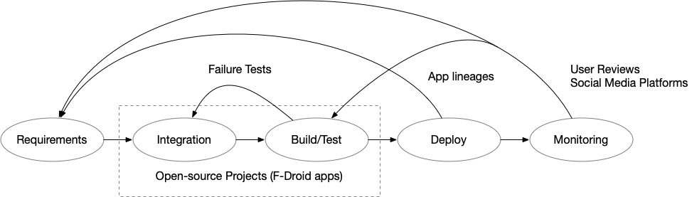

# Artefacts for Release Engineering of Mobile Apps
https://docs.google.com/document/d/1d4Xmv-Mql25whIYZRCckuz6S0kw4CKTk-2CFZGgZVKY/edit?usp=sharing

Participants: Cuiyun Gao, Yasutaka Kamei, Li Li, Shane McIntosh, Sebastian Proksch

## Discussion Focus

The problems discussed are not specific to mobile app stores, rather than to generic centralized app stores (like Steam Game Platform, MS Windows Appstore, etc.). We think that, to draw the line between an *App Store* and a regular package manager is the ability of users to review and rate the individual store elements.

## Different Sources:

- User facing:
	- social media (reddit, blogs, twitter, FB, forums)
- Developer facing
	- app stores
    	- Apple, Google, Steam (commercial)
    	- F-Droid (probably not representative), Linux Package Managers ... (open source)
	- app releases (app lineage)
	- commit history
	- StackOverflow Discussion
	- Android Framework Evolution
- In between:
	- Logs
	- Crash Reports
	
	
## Pipeline

| RelEng Phase                 | Artifacts |
| ------------------------     | -------------------- |
| **Requirements Engineering** | social media, user reviews        |
| Integration                  | Open Source App Stores (e.g., F-Droid)  |
| Build + Test                 | Git, CI Providers |
| Deployment                   | app lineage |
| **Monitoring + Reaction**    | logs, social media, user reviews   |

The bold phases are the ones that can benefit most from the use of social media.
We can use posts as indicators of the release process or to mine new requirements.

The other phases are a *black box* for commercial apps. It is hard to study these,
because we lack access to reliable sources.

In general, several research challenges have to be solved, like how to automatically map social media posts and apps.
