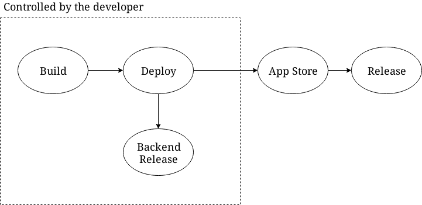

# Overcoming Fragmentation for Deployment

## Members
Carmine, Keheliya, Raula, Lili, Daniel D, Lili

## Definitions

Push-based deployment model (in case of a web app):
```
Build -> Deploy -> Release
```

Pull-based deployment model (in case of mobile apps): A pull request is generated when the app is submitted to the App Store. The App store can refuse/accept it as well as the user.



Frontend & Backend versioning

App Reviews vs. Release logs

Fragmentation

## Challenges

### For devs
Misaligment on Frontend & Backend

Tracebility of app reviews to an app version (and therefore to a changelog)

Tracebility between user and developer artifacts

Can not force users to update

Support legacy software

### For researchers
Lack of data for studies. In particular backend information

## Research directions

Feature toggle updates to emulate canary updates (How to get them right and proper)

Factors that drive changes and updates to the users
  (What is a good release note that make people want to update faster?)
  
Usage of network logs for aproximating the backend behaviour
Compare the behaviour of the webapp to the frontend against the same backend

